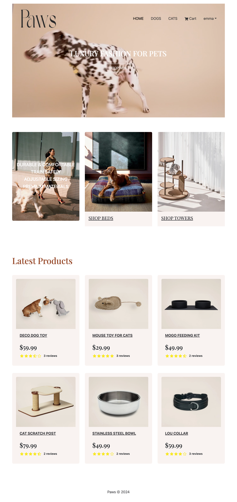
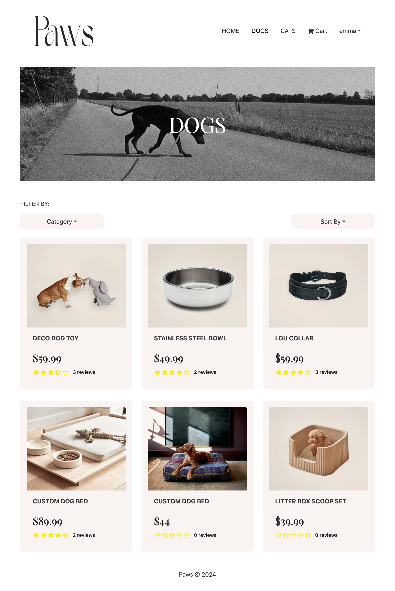
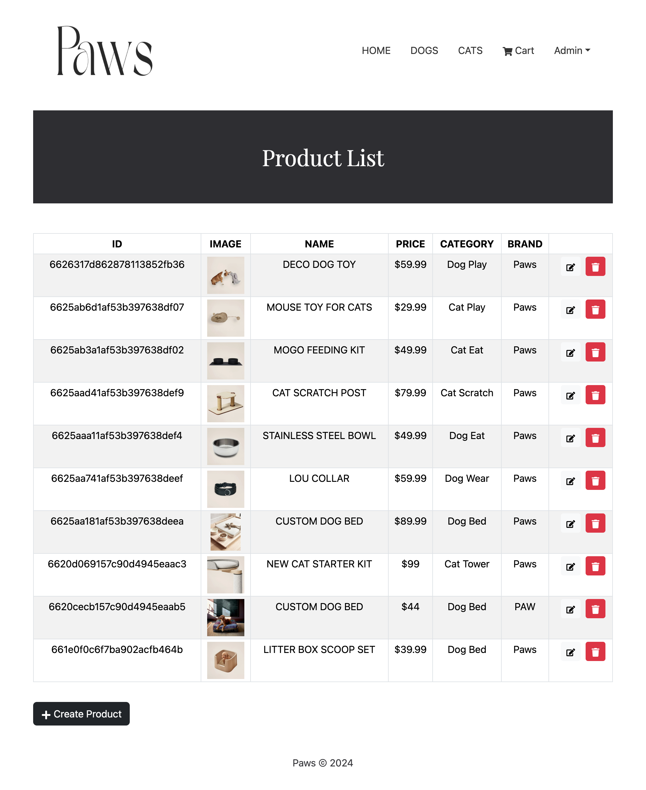
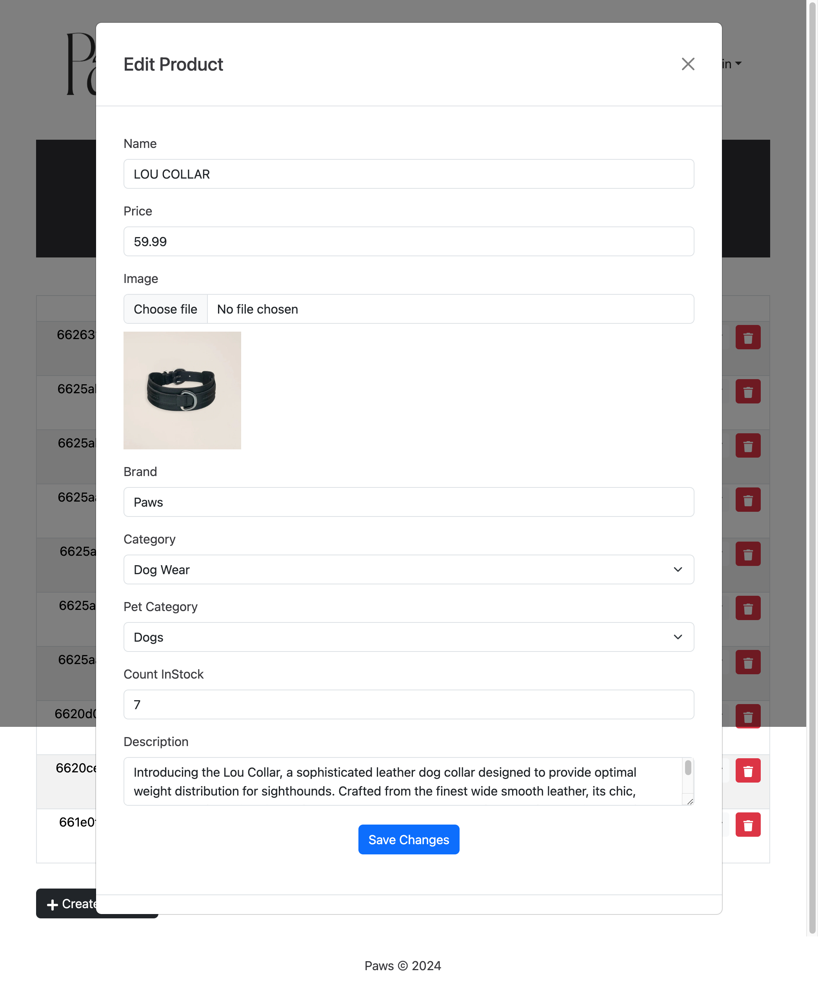

# Paws E-Commerce Store

To view the website, click this link:<a href="https://paws-t05n.onrender.com"> Paws Boutique Shop</a>

## Description

Welcome to the Paws E-Commerce Store! This platform allows users to shop for pet-related products and enables administrators to manage products and orders.

## Screenshot Images



## Table of Contents

- [Project Title](#project-title)
  - [Description](#description)
  - [Screenshot Images](#screenshot-images)
  - [Table of Contents](#table-of-contents)
  - [Features](#features)
  - [Teck Stack](#tech-stack)
  - [Installation](#installation)

## Features

### User Features

1. **Authentication and Authorization:**

   - Users can sign up, sign in, and sign out.
   - Authentication middleware ensures that certain routes are accessible only to authenticated users.
   - User roles are defined (regular user and admin).

2. **Product Management:**

   - View all products or view products by pet category.
   - Filter products by category.
   - Sort products by price and creation date.
   - View product details.
   - Add products to the shopping cart.
   - Modify quantities of items in the cart.
   - Client-side validation for adding products to the cart.

3. **Shopping Cart:**

   - Store shopping cart items in the user's session or database.
   - Allow users to update and remove items from the cart.
   - Calculate subtotal, taxes, and total price.

4. **Order Management:**
   - Place orders for selected products.
   - View order history and details.
   - Checkout process with shipping and billing information.
   - Handle order confirmation and payment processing.

### Admin Features

1. **Admin Authentication and Authorization:**

   - Separate dashboard for admin users with restricted access.
   - Admin authentication and authorization.

2. **Product Management:**

   - View all products.
   - Create, update, and delete products.
   - Upload product images and manage inventory.
   - Server-side validation for product management actions.

3. **Order Management:**
   - View all orders with pagination support.
   - Update order status and delivery status.
   - Notify users about order updates.

## Tech stack

- React
- Redux
- Redux Toolkit
- Node.js
- Express
- MongoDB
- Mongoose
- JavaScript
- HTML
- CSS
- React Bootstrap
- Cloudinary

## Getting Started

1. Clone the repository:

   ```bash
   git clone https://github.com/your_username/pet-e-commerce-store.git

   ```

2. The application is currently not deployed. After cloning the repository make sure you install dependencies:

```
npm install
npm run build
```

3. Create .env file to import MongoDB URL,Mapbox API key, Cloudinary API Key

4. Then start the back-end and front-end server:

```
npm run dev
```

## Next steps

- [ ] Add search product feature
- [ ] Add react Paypal payment gateway
- [ ] Add user management features
